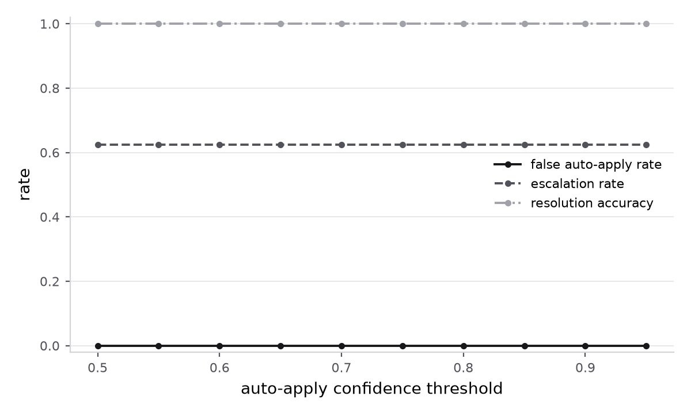
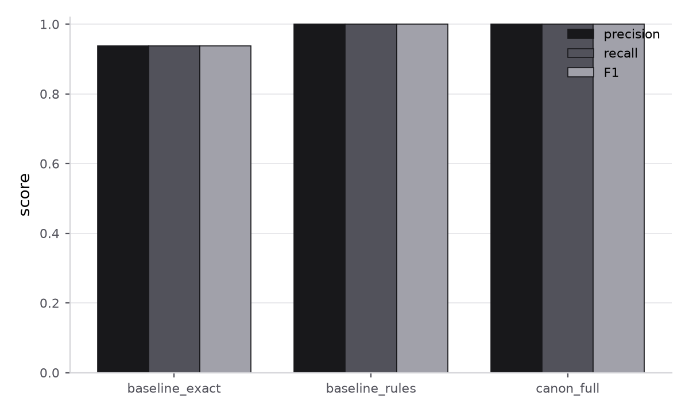

# Canon — evaluation results

Seed `42` · dataset `data\run42`

> **These numbers are not the agent's.**
>
> `canon_full` issued 2 model calls and every one failed, so those conflicts escalated on the failure path rather than being proposed. Its column below is the deterministic pipeline.
>
> First error: `BadRequestError: Error code: 400 - {'type': 'error', 'error': {'type': 'invalid_request_error', 'message': 'Your credit balance is too low to access the Anthropic API. Please go to Plans & Billing to upgrade or purchase credits.'}, 'request_id': 'req_011CdsW7BCazWx9WTdruzgMG'}`
>
> Fix the cause and re-run before citing anything under `canon_full`.

Regenerate with:

```bash
uv run python -m eval.generate --seed 42 --accounts 500 --out data\run42
uv run python -m eval.harness --seed 42 --systems all --report
```

## Systems

`baseline_exact` is the floor: exact matching, no normalization.
`baseline_rules` shares the entire detection path with `canon_full` and
differs only in that no model is called — whatever separates the two is
attributable to the agent.

| metric | baseline_exact | baseline_rules | canon_full |
|---|---|---|---|
| precision | 0.938 | 1.000 | 1.000 |
| recall | 0.938 | 1.000 | 1.000 |
| F1 | 0.938 | 1.000 | 1.000 |
| resolution accuracy | 0.000 | 1.000 | 1.000 |
| **false auto-apply rate** | 0.000 | 0.000 | 0.000 |
| escalation rate | 0.000 | 0.625 | 0.625 |
| escalation precision | 0.000 | 0.100 | 0.100 |
| conflicts detected | 208 | 208 | 208 |
| true positives | 195 | 208 | 208 |
| false positives | 13 | 0 | 0 |
| false negatives | 13 | 0 | 0 |
| auto-applied | 0 | 78 | 78 |
| escalated | 0 | 130 | 130 |
| model calls | 0 | 0 | 0 |
| tokens | 0 | 0 | 0 |
| USD / 1k conflicts | 0.00 | 0.00 | 0.00 |

## Ablation 1 — without the `validate` node

`validate` rejects any proposed value that is not one of the two observed
values or a legal normalization of one. Removing it changes nothing about
what the model is asked; it changes only whether the answer is checked.

**Invented values produced with the node removed: 0.**
With the node in place the count is zero by construction.

| metric | no_validate |
|---|---|
| precision | 1.000 |
| recall | 1.000 |
| F1 | 1.000 |
| resolution accuracy | 1.000 |
| **false auto-apply rate** | 0.000 |
| escalation rate | 0.625 |
| escalation precision | 0.100 |

## Ablation 2 — auto-apply threshold sweep

The precision/recall tradeoff curve for the whole system. Every point
reuses the same proposals — moving the gate re-derives which side of it
each answer falls on, so the sweep costs no additional tokens.



| threshold | false auto-apply | escalation rate | resolution accuracy |
|---|---|---|---|
| 0.50 | 0.000 | 0.625 | 1.000 |
| 0.55 | 0.000 | 0.625 | 1.000 |
| 0.60 | 0.000 | 0.625 | 1.000 |
| 0.65 | 0.000 | 0.625 | 1.000 |
| 0.70 | 0.000 | 0.625 | 1.000 |
| 0.75 | 0.000 | 0.625 | 1.000 |
| 0.80 | 0.000 | 0.625 | 1.000 |
| 0.85 | 0.000 | 0.625 | 1.000 |
| 0.90 | 0.000 | 0.625 | 1.000 |
| 0.95 | 0.000 | 0.625 | 1.000 |

## Detection quality


